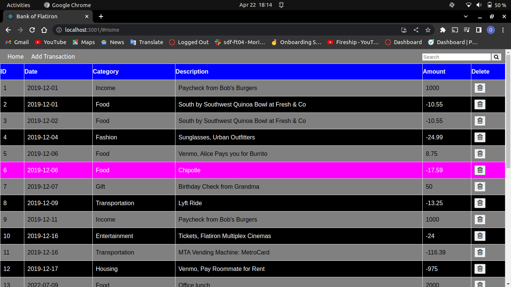

## Bank of Flatiron ##

Using a table, this React application shows a list of all financial transactions which took place over a specific time frame. In addition, the user can populate a transaction by providing the date, sum, description, and transaction type in the table. Additionally, using the search bar in the header, one can find the transaction's details by following its description.

## Demos ##
The pictures as shown depict the outlook of the web app

## Home Page ##

## Add Transaction ##

## Getting started ##
To run this application:

*Clone from here [Bank of Flatiron](https://github.com/Ngaremaina/Bank-of-Flatiron)

*Run this command to start the json server: *json-server --watch db.json 

*Run this command to start the React Application: *npm start

# Author #
Owen Ngare

# License #
Apache License

